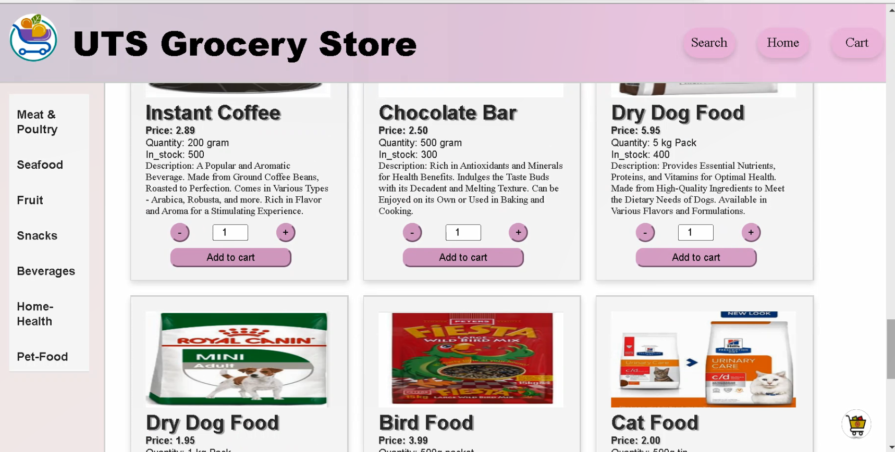
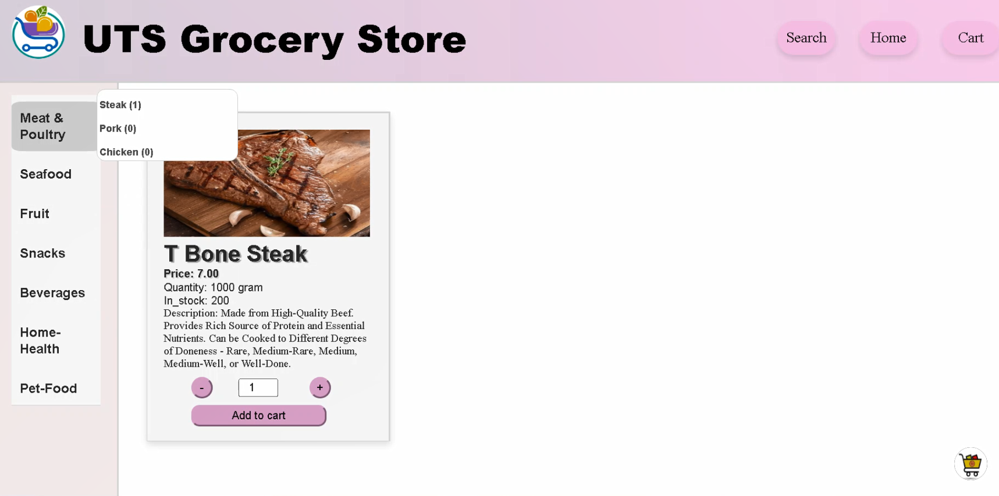
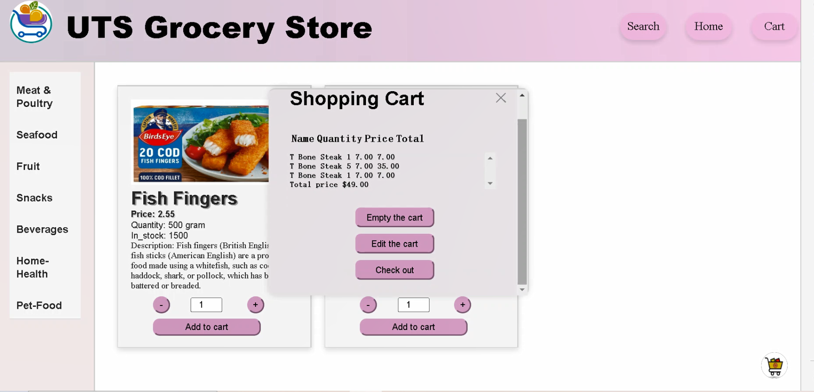
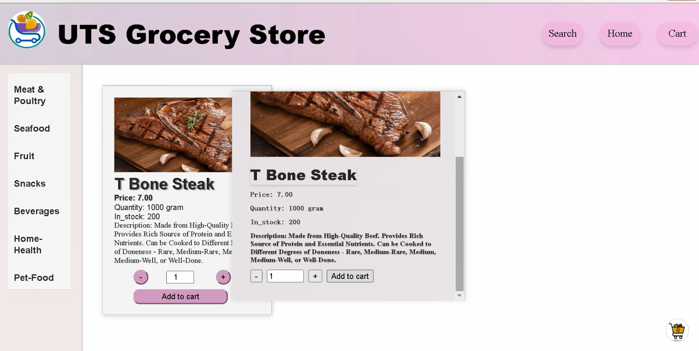
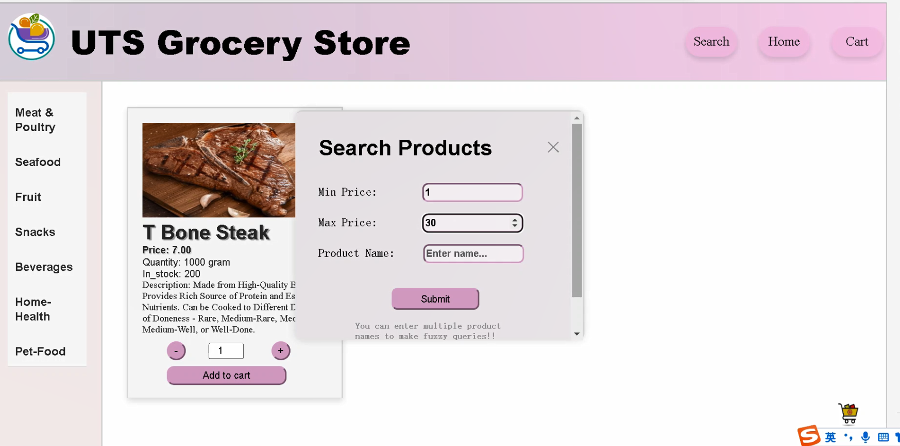
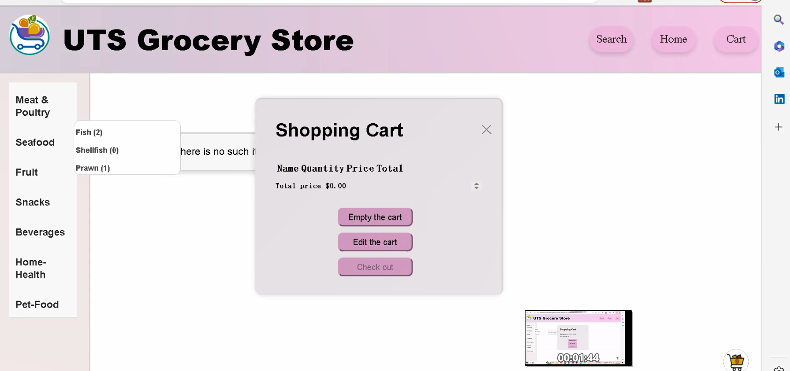
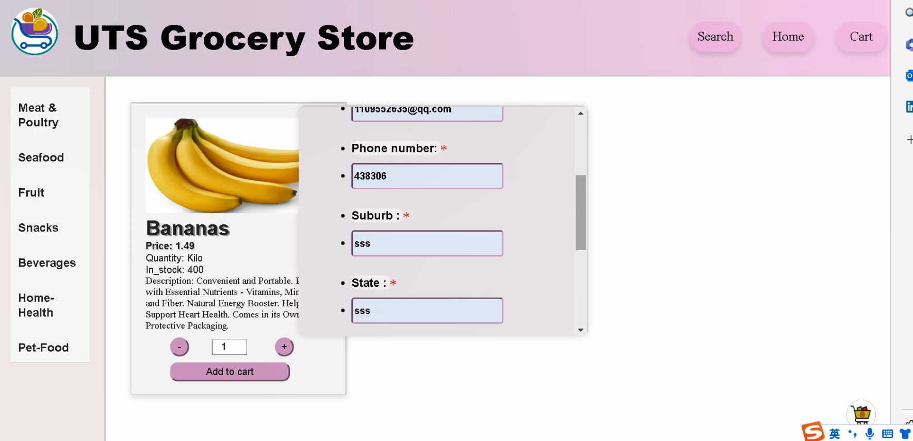
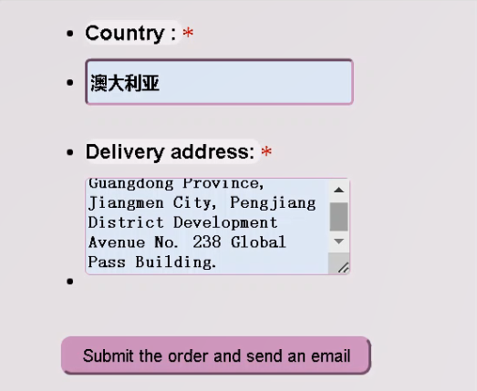
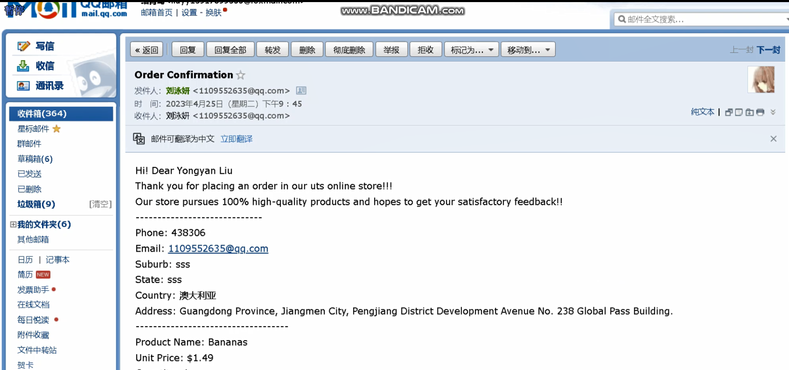

# PHP Shopping Website Project

This project is a PHP-based online shopping platform where users can browse, filter, and purchase items. The platform enables users to manage their shopping cart, place orders, and receive confirmation emails upon successful checkout.

---

## Features

1. **Browse Products**:
   - Users can view a list of products with details such as name, price, and description.

2. **Search and Filter**:
   - Search for products using keywords and filter by categories.

3. **Shopping Cart**:
   - Add items to the cart, manage quantities, or clear the cart.

4. **Checkout**:
   - Process orders and receive email confirmation upon successful purchase.

---

## File Structure and Methods

### Main Files
#### `index.php`
- **Purpose**: Homepage of the website displaying all products.
- **Method**:
  - Fetches product data from the database.
  - Displays product listings dynamically using PHP loops.
  - Includes links to add items to the shopping cart or filter products.

#### `list_item.php`
- **Purpose**: Displays detailed product listings.
- **Method**:
  - Retrieves product details using SQL queries.
  - Formats and displays the items with pagination (if implemented).

---

### Shopping Cart
#### `add-to-cart.php`
- **Purpose**: Adds selected items to the shopping cart.
- **Method**:
  - Receives product IDs via HTTP POST or GET requests.
  - Stores the item data in a PHP session or database table.
  - Checks for duplicate entries and updates quantities accordingly.

#### `cart.php`
- **Purpose**: Displays all items currently in the cart.
- **Method**:
  - Fetches cart data from the session or database.
  - Calculates subtotal, tax, and total amounts dynamically.
  - Provides options to update quantities or proceed to checkout.

#### `clear_cart.php`
- **Purpose**: Clears all items from the cart.
- **Method**:
  - Resets the session variables storing cart data.
  - Provides user feedback confirming the cart has been cleared.

#### `get-cart.php`
- **Purpose**: Retrieves shopping cart details for display or processing.
- **Method**:
  - Executes SQL queries or reads session variables to retrieve cart contents.
  - Returns structured data in JSON format for use in AJAX requests.

---

### Search and Filter
#### `search.php` & `search.js`
- **Purpose**: Implements a search bar for finding products by name or description.
- **Method**:
  - Accepts input via an HTML form.
  - Uses SQL `LIKE` queries to find matching items in the database.
  - Displays results dynamically without reloading the page using AJAX.

#### `categoriesDBsearch.php`
- **Purpose**: Filters products by category.
- **Method**:
  - Executes parameterized SQL queries to retrieve items within a selected category.
  - Ensures efficient filtering by indexing category columns in the database.

---

### Checkout and Email
#### `checkout.php`
- **Purpose**: Handles order placement and checkout process.
- **Method**:
  - Validates user input (e.g., shipping address, email).
  - Processes payment logic (if implemented).
  - Stores order details in the database.
  - Sends a confirmation email to the user upon successful checkout.

#### `SMTP.php` & `PHPMailer.php`
- **Purpose**: Sends email confirmations to users.
- **Method**:
  - Uses the PHPMailer library to send emails via an SMTP server.
  - Configures email credentials, subject, and body content dynamically.
  - Handles exceptions and logs errors using `Exception.php`.

---

### UI and Assets
#### `cartstyle.css`
- **Purpose**: Provides styling for the shopping cart and overall website.
- **Key Features**:
  - Styled buttons for adding/removing items.
  - Organized layout for displaying products in a grid format.

#### `side_menu.php`
- **Purpose**: Displays a navigational menu for category filtering.
- **Method**:
  - Dynamically generates category links using data from the database.

#### `main_content.php`
- **Purpose**: Displays the main content of the website, such as product listings or search results.
- **Method**:
  - Integrates with other PHP files to display filtered or full product data.

---

### Configuration
#### `composer.json` and `composer.phar`
- **Purpose**: Manage PHP dependencies for the project.
- **Method**:
  - Lists required libraries like PHPMailer.
  - Allows easy installation and updates using Composer commands.

---

## Installation and Setup

### Prerequisites
1. **Web Server**: Install Apache or Nginx.
2. **PHP**: PHP version 7.x or later.
3. **Database**: MySQL or MariaDB.
4. **Composer**: For managing PHP libraries like PHPMailer.

### Steps
1. **Clone the repository**:
   ```bash
   git clone <repository_url>
   cd <project_directory>
     ```
2. **Install PHP dependencies**:


  ```bash
composer install
  ```
3. **Set up the database**:

Import the SQL schema file (if provided) into your database.
Update database credentials in the PHP files (e.g., config.php).
4. **Configure email settings**:

Open SMTP.php and set the SMTP host, username, and password.
5. **Run the project**:

Start your web server and navigate to the project directory in your browser:
bash

  ```http://localhost/<project_directory>  ```
  
### Usage
**Browse Products**:

Navigate to the homepage to view available products.
**Search and Filter**:

Use the search bar or category menu to find specific items.
**Add to Cart**:

Add desired products to your cart and view the cart to manage items.
**Checkout**:

### Usage

#### **Browse Products**
- Navigate to the homepage to view available products.

#### **Search and Filter**
- Use the search bar or category menu to find specific items.

#### **Add to Cart**
- Add desired products to your cart and view the cart to manage items.

#### **Checkout**
1. Proceed to checkout and complete the order form.
2. Receive a confirmation email upon successful checkout.

---

## Dependencies

- **PHPMailer**: Handles email sending functionality.
- **Composer**: Dependency management for PHP libraries.

---

## Future Improvements

### **User Authentication**
- Add login and registration for personalized user experiences.

### **Payment Integration**
- Secure payment gateways like PayPal or Stripe.

### **Advanced Filtering**
- Add multi-criteria filtering (e.g., price range, product ratings).

### **Mobile Optimization**
- Ensure a responsive design for better usability on mobile devices.

---

## License

This project is open-source and available under the [MIT License](https://opensource.org/licenses/MIT).

## Relative picture:










